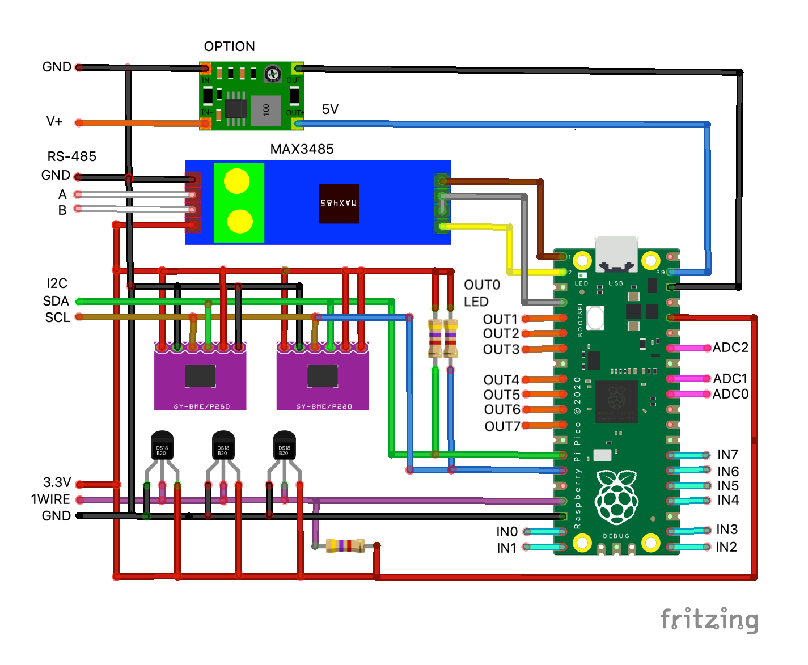
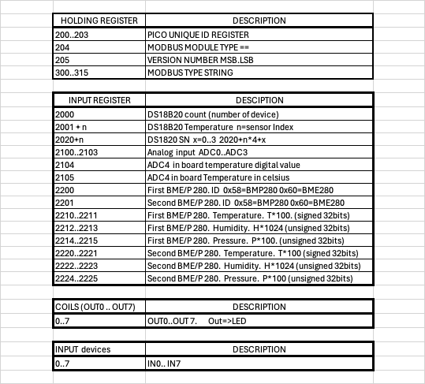

# Modbus RTU Slave library for Raspberry Pi Pico (RP2040) based on the C++ SDK
This repository contain **working** example Modbus RTU Slave implementation for rp2040 (Raspberry Pi Pico) with C++ SDK

This is a fork from https://github.com/gleboss-redfab/rp2040-modbus_example 
From the fork base class modbusManager, modbus.hpp,  I create a subclass ModbusPico. 
This way I just need to modify ModbusPico class to add function. 

On the current example the modbus layout has 8 outputs, 8 inputs, one wire DS18B20 line and analog ADC inputs. 

## Update 6Feb 2024
- add two BME280/BMP280  sensors on i2c gpio10 and gpio11 
  input register address 
  2200  SENSOR1 type, 0 = none/error, 0x58= BMP280, 0x60=BME280 
  2201  SENSOR2 type, 0 = none/error, 0x58= BMP280, 0x60=BME280 
  22..  future usage  
  2210..19  SENSOR1 RANGE  
  2220..29  SENSOR2 RANGE  
  2230...   future usage   

  For BME280
  offset 0..1   signed 32bits temper temperature * 100 in celsius 
  offset 2..3 unsigned 32bits Humidity * 1024   in % 
  offset 4..5 unsigned 32bits Pressure * 100    in HPa 
  offset 6..9  invalid 

  For BMP280  offfset 2..3 for humidity will be set to zero. 
  N.B. if no sensor the data will be zero 
   
  Check readBME280.py for info 

## Features:
- Modbus RTU Slave
- **RS-485** support
- C++ style class 
- Registers layout
- Separate setup read-only and read-write registers
- UART 0 and 1 support
- it works out of box and tested

## How to use the example:
- Tune VS Code for Raspberry Pico development ([instruction](https://www.youtube.com/watch?v=B5rQSoOmR5w))
- You can use 2nd Raspberry Pico as a bootloader and debuger ([instruction](https://www.youtube.com/watch?v=jnC5LrTx470))
- Modify launch.json and setting.json files in .vscode according to your environment
- Start the debugging session 
- Use Modbus Master emulator for connection (ModBus Poll for example)
- Change UART parameters in main.cpp and registers layout in modbus.cpp for your purpose
- Change stored data inside Modbus Manager class
- Change Switch-case optins according to your data and registers in *mb_read_holding_register()* and *mb_write_single_register()*
- 
## How to compile using a raspberry Pi connected to the swd
-  Follow the installation step from the PDF  "Raspberry Pi Pico c/C++ SDK". https://www.raspberrypi.com/documentation/microcontrollers/c_sdk.html
-  clone the github.  <b>git clone https://github.com/danjperron/rp2040-modbus_example.git</b> 
-  Enter the  rp2040-modbus_example folder.   <b>cd rp2040-modbus_example</b> 
-  Create the build folder.   <b>mkdir build</b> 
-  Enter the build folder.     <b>cd build</b> 
-  Create the cmake environnement.     <b>cmake ..</b>
-  Compile.       <b>make</b> 
-  To transfer use openocd.  https://iosoft.blog/2019/01/28/raspberry-pi-openocd  

